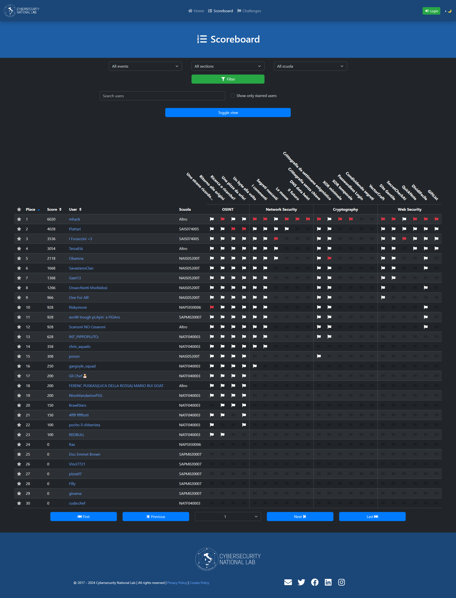

# ITASEC2024 - HighSchools CTF Workshop

Challenge per l'HighSchools CTF Workshop di ITASEC2024 @ Salerno - 12/04/2024

## Challenges

| Category | Title                                             | Author                         | Dynamic            | Type  | Url                                    | Port  |
| :------- | :------------------------------------------------ | :----------------------------- | :----------------: | ----: | -------------------------------------: | :---: |
| crypto   | [Crittografia senza chiave](crypto01)             | Matteo Rossi <@mr96>           | :x:                |       |                                        |       |
| crypto   | [Crittografia da settimana enigmistica](crypto02) | Matteo Rossi <@mr96>           | :x:                |       |                                        |       |
| crypto   | [XOR minimale](crypto03)                          | Matteo Rossi <@mr96>           | :heavy_check_mark: | http  | xorminimale.challs.olicyber.it         | 80    |
| crypto   | [XOR temporale](crypto04)                         | Matteo Rossi <@mr96>           | :heavy_check_mark: | http  | xortemporale.challs.olicyber.it        | 80    |
| crypto   | [Passwordless Login](crypto05)                    | Matteo Rossi <@mr96>           | :heavy_check_mark: | http  | passwordlesslogin.challs.olicyber.it   | 80    |
| crypto   | [Condividendo segreti](crypto06)                  | Matteo Rossi <@mr96>           | :heavy_check_mark: | http  | condividendosegreti.challs.olicyber.it | 80    |
| network  | [Un byte alla volta](network01)                   | Giulia Martino <@Giulia>       | :x:                |       |                                        |       |
| network  | [I commenti](network02)                           | Giulia Martino <@Giulia>       | :x:                |       |                                        |       |
| network  | [Segreti nascosti](network03)                     | Giulia Martino <@Giulia>       | :x:                |       |                                        |       |
| network  | [Le mosse](network04)                             | Giulia Martino <@Giulia>       | :heavy_check_mark: | http  | lemosse.challs.olicyber.it             | 80    |
| network  | [Il futuro](network05)                            | Giulia Martino <@Giulia>       | :x:                |       |                                        |       |
| network  | [DNS data heist](network06)                       | Giulia Martino <@Giulia>       | :x:                |       |                                        |       |
| osint    | [Uno strano ricordo...](osint01)                  | Gaspare Ferraro <@Gaspare>     | :x:                |       |                                        |       |
| osint    | [Ritorno alle origini](osint02)                   | Gaspare Ferraro <@Gaspare>     | :x:                |       |                                        |       |
| osint    | [Ricerca o ricerche?](osint03)                    | Gaspare Ferraro <@Gaspare>     | :x:                |       |                                        |       |
| osint    | [Una pizza da urlo!](osint04)                     | Gaspare Ferraro <@Gaspare>     | :x:                |       |                                        |       |
| web      | [VectorCraft](web01)                              | Gianluca Altomani <@devgianlu> | :heavy_check_mark: | http  | vectorcraft.challs.olicyber.it         | 80    |
| web      | [Sito Gentile](web02)                             | Gianluca Altomani <@devgianlu> | :heavy_check_mark: | http  | sitogentile.challs.olicyber.it         | 80    |
| web      | [SecretCheckAI](web03)                            | Gianluca Altomani <@devgianlu> | :heavy_check_mark: | http  | secretcheckai.challs.olicyber.it       | 80    |
| web      | [QuickNote](web04)                                | Gianluca Altomani <@devgianlu> | :heavy_check_mark: | http  | quicknote.challs.olicyber.it           | 80    |
| web      | [DividiFacile](web05)                             | Gianluca Altomani <@devgianlu> | :heavy_check_mark: | http  | dividifacile.challs.olicyber.it        | 80    |
| web      | [GiftList](web06)                                 | Gianluca Altomani <@devgianlu> | :heavy_check_mark: | http  | giftlist.challs.olicyber.it            | 80    |

## Scoreboard

