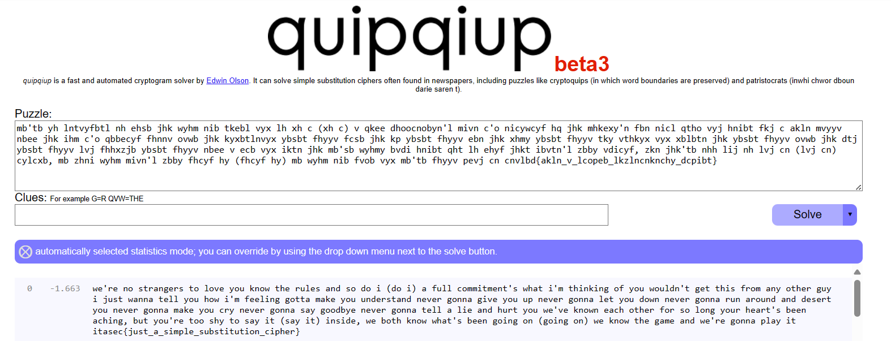

# ITASEC24 - CTF Workshop

## [crypto] Crittografia da settimana enigmistica (13 risoluzioni)

Niente di meglio di un classico crittogramma :)

`mb'tb yh lntvyfbtl nh ehsb jhk wyhm nib tkebl vyx lh xh c (xh c) v qkee dhoocnobyn'l mivn c'o nicywcyf hq jhk mhkexy'n fbn nicl qtho vyj hnibt fkj c akln mvyyv nbee jhk ihm c'o qbbecyf fhnnv ovwb jhk kyxbtlnvyx ybsbt fhyyv fcsb jhk kp ybsbt fhyyv ebn jhk xhmy ybsbt fhyyv tky vthkyx vyx xblbtn jhk ybsbt fhyyv ovwb jhk dtj ybsbt fhyyv lvj fhhxzjb ybsbt fhyyv nbee v ecb vyx iktn jhk mb'sb wyhmy bvdi hnibt qht lh ehyf jhkt ibvtn'l zbby vdicyf, zkn jhk'tb nhh lij nh lvj cn (lvj cn) cylcxb, mb zhni wyhm mivn'l zbby fhcyf hy (fhcyf hy) mb wyhm nib fvob vyx mb'tb fhyyv pevj cn cnvlbd{akln_v_lcopeb_lkzlncnknchy_dcpibt}`

## Soluzione

Come suggerito dalla descirzione, ci troviamo davanti ad un crittogramma. Facendo qualche ricerca online (ad esempio "
online cryptogram solver"), è possibile trovare il sito [https://quipqiup.com/](https://quipqiup.com/), con il quale è
facilmente possibile risolvere il crittogramma automaticamente e ottenere la flag.

