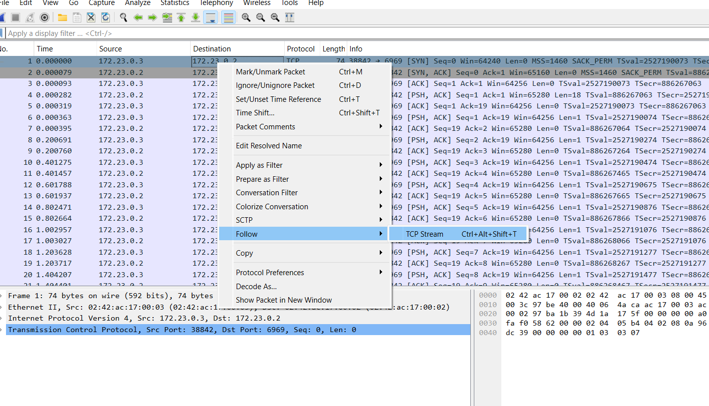
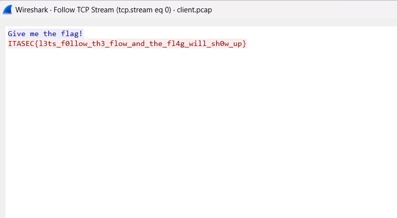

# ITASEC24 - CTF Workshop

## [network] Un byte alla volta (15 risoluzioni)

Abbiamo intercettato il client mentre mandava la flag al server. Riesci a trovarla?

Per analizzare il file pcap, è consigliato utilizzare un tool come [Wireshark](https://www.wireshark.org/download.html).

## Soluzione

Il file pcap contiene il traffico catturato mentre un client manda la flag al server. Come suggerisce il titolo della
challenge, la flag è mandata dal client un byte alla volta, quindi la flag è distribuita nei pacchetti `tcp`, un byte
per ogni pacchetto. Nonostante sia possibile estrarre la flag dai pacchetti analizzandoli a mano uno alla volta, la
soluzione più semplice per risolvere questa challenge è fare click-destro sul primo pacchetto `tcp` e cliccare poi su
_Follow -> TCP Stream_ per leggere la flag intera.

