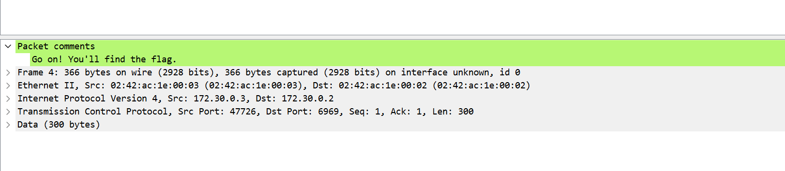
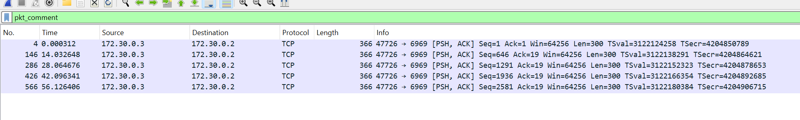

# ITASEC24 - CTF Workshop

## [network] I commenti (14 risoluzioni)

Ci sono un sacco di pacchetti qui. Ma ti ho lasciato dei commenti...

## Soluzione

Il file pcap contiene un sacco di pacchetti tcp, nessuno dei quali sembra avere alcun contenuto interessante. Pensando
al titolo e descrizione della challenge, si può dedurre che si debba fare attenzione a qualche tipo di commenti lasciati
dall'autore. Cercando dei pattern all'interno del file, si può notare che quasi tutti i pacchetti hanno una dimensione
abbastanza piccola, circa 60-80 bytes, a parte pochissimi, che hanno una lunghezza tutti uguale, 366 byte. Cliccando sul
primo di questi pacchetti, possiamo notare che, a differenza degli altri, contiene una "riga" in più nella sezione
dettagli, riservata ai _Packet comments_:

Il commento ci lascia intendere che dobbiamo continuare a leggere anche tutti gli altri commenti nei pacchetti. Per
filtrare i pacchetti in modo da visualizzare soltanto quelli che hanno effettivamente dei commenti, è possibile
utilizzare il filtro `pkt_comment` nella barra di Wireshark:

Cliccando uno alla volta sui pacchetti filtrati e leggendone i commenti, si può ottenere la flag.
