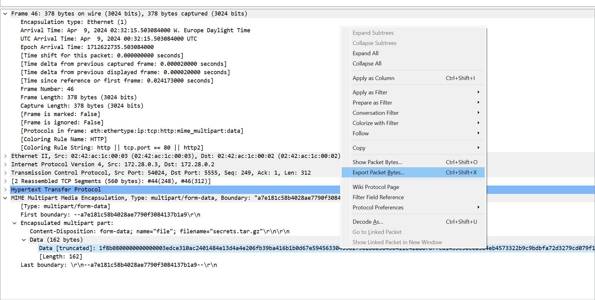

# ITASEC24 - CTF Workshop

## [network] Segreti nascosti (5 risoluzioni)

Credo ci sia un file contenente segreti nascosti qua dentro. Puoi _estrarlo_ per me?

## Soluzione

Il file pcap contiene il traffico catturato mentre un client si connette ad un sito web con una richiesta GET HTTP, e
poi esegue richieste POST HTTP ad un endpoint `/upload`, che fa immaginare stia caricando qualche tipo di file sul
server. Analizzando le richieste, per esempio utilizzando lo strumento _Follow HTTP stream_, possiamo notare che una
sola delle richieste POST sembra andare a buon fine, ed è quella che carica il file `secrets.tar.gz`. Considerando che
la challenge chiede di estrarre i segreti nascosti nel pcap, probabilmente dobbiamo estrarre il file `secrets.tar.gz` e
leggerne il contenuto. Possiamo espandere i dettagli del pacchetto fino ad arrivare al contenuto del form e, facendo
click destro sulla sezione _Data_, cliccare su _Export packet bytes_.

A questo punto possiamo salvare il file, rinominarlo con estenzione `.tar.gz` e infine estrarne il contenuto: da Linux,
è possibile estrarlo utilizzando il comando `tar xzf secrets.tar.gz`; da Windows, è possibile estrarlo semplicemente
facendo doppio click su di esso.
