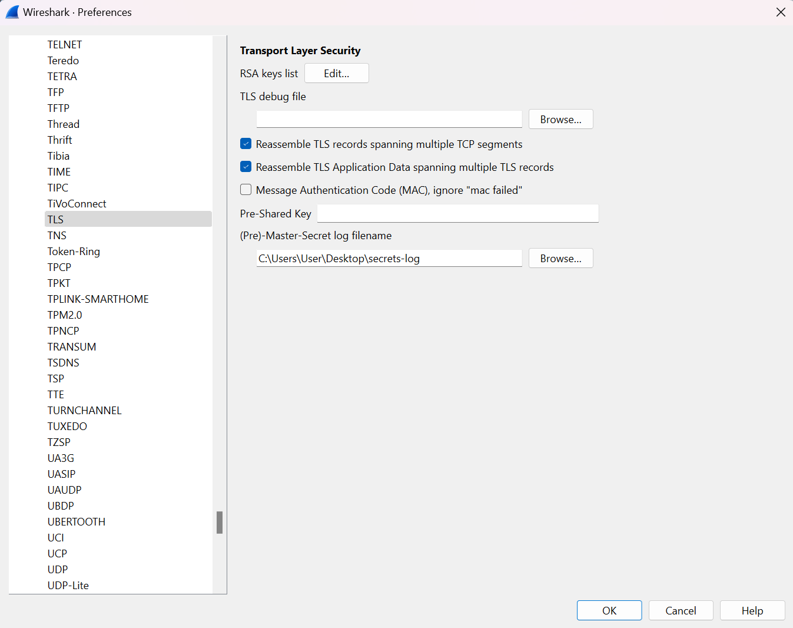

# ITASEC24 - CTF Workshop

## [network] Il futuro (1 risoluzioni)

HTTP3 è il futuro. E quindi è meglio iniziare ad allenarsi. E' tutto illeggibile dentro questo pcap, ma credo ci sia un
modo per decifrare il contenuto!

Per risolvere questa challenge è consigliato scaricare l'ultima versione di Wireshark. Versioni troppo datate potrebbero
rendere più difficile la risoluzione.

## Soluzione

Il file pcap contiene un numero abbastanza piccolo di pacchetti, divisi fra diversi protocolli (ARP, QUIC, HTTP3,
ICMPv6). Come ci suggerisce il titolo, concentriamoci sui pacchetti HTTP3. Il loro contenuto non è leggibile, infatti
HTTP3 richiede l'utilizzo di TLS e quindi i pacchetti sono cifrati, ma la descrizione della challenge ci indica che si
possano decifrare. Fra gli allegati, oltre al pcap stesso, abbiamo un file `secrets-log` che sembra contenere dei
segreti del server e del client; è possibile allora che questo sia il file necessario per decifrare TLS e leggere il
contenuto dei pacchetti.

Cliccando su _Edit -> Preferences_, espandendo la sezione _Protocols_ e cliccando infine su _TLS_, possiamo caricare il
nostro file nella box _(Pre)-Master-Secret log filename_. In questo modo i pacchetti saranno decifrati e sarà possibile
leggerne il contenuto. Come detto prima, concentriamoci solo sui pacchetti HTTP3. Analizzandoli uno alla volta e
ispezionandoli dalla finestra dei dettagli pacchetto, è possibile notare che il pacchetto numero 15 contiene un header
diverso dagli altri, chiamato `flag`, il cui valore è proprio la flag stessa.

