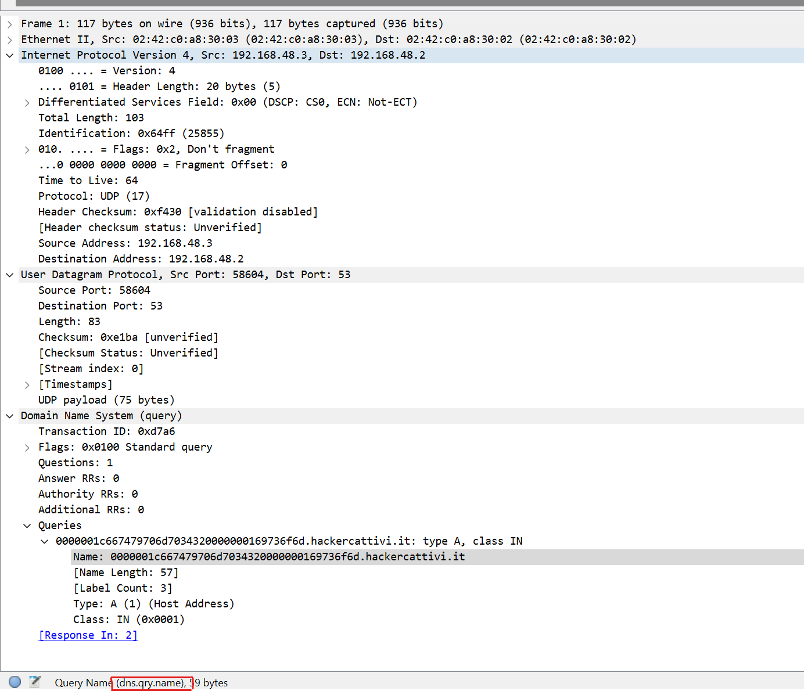
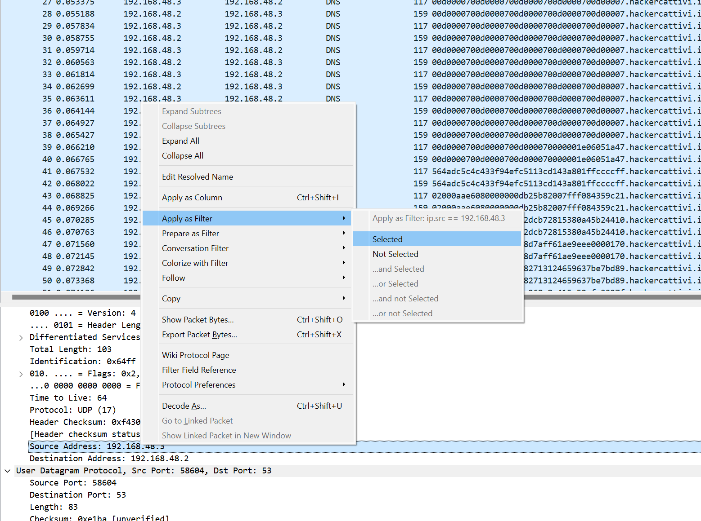
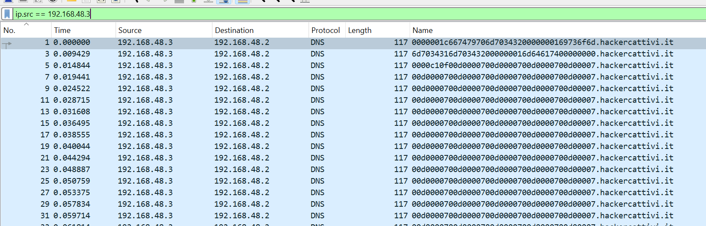
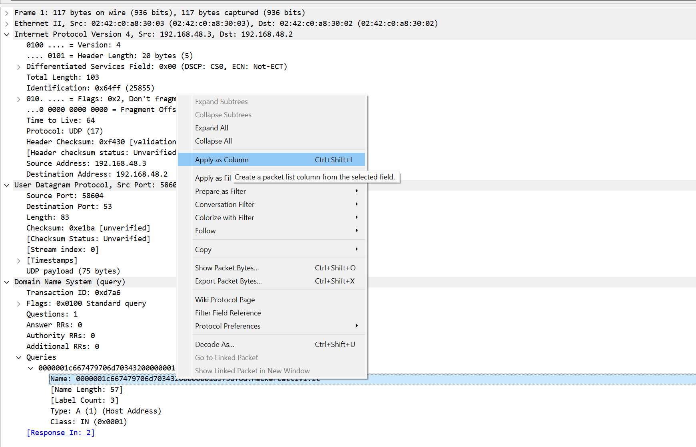
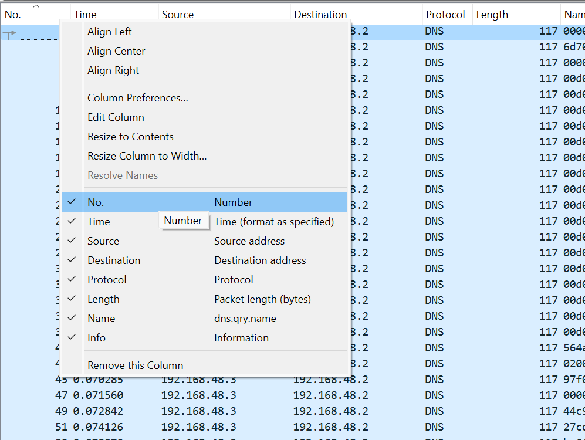

# ITASEC24 - CTF Workshop

## [network] DNS data heist (1 risoluzioni)

Questo pcap è decisamente troppo strano. C'è qualcosa che non quadra in tutte quelle query DNS...

## Soluzione

Il file pcap contiene tanti pacchetti DNS, circa 5500. Si può molto velocemente notare che c'è un pattern ben definito
query DNS - risposta, fra un client e un server. Tuttavia, non sembra che le query DNS siano "normali": contengono tutte
dei domain name molto simili, formati da una serie di caratteri esadecimali e poi il suffisso `hackercattivi.it`.
Riflettendo su titolo e descrizione della challenge, si può intuire che le query DNS siano state utilizzate in qualche
modo per esfiltrare dei dati, e l'opzione più plausibile è che questi dati siano stati codificati nei caratteri
esadecimali presenti nel dominio.

Possiamo quindi provare ad estrarli, per verificare che cosa contengono. Per ogni domain name ci sono due pacchetti, una
richiesta e una risposta. Non vogliamo duplicare i dati, quindi dovremo tenere soltanto una delle due. Notiamo che tutti
i pacchetti richiesta hanno come sorgente l'ip `192.168.48.3` e destinazione `192.168.48.2`, mentre le risposte hanno
chiaramente i due indirizzi ip invertiti; il primo sarà quindi l'indirizzo del client, e il secondo quello del server
DNS. Un modo per evitare di duplicare i dati, perciò, è filtrare soltanto i pacchetti che hanno come ip sorgente
l'ip `192.168.48.3`. Inoltre, i dati che vogliamo esportare sono contenuti nel nome di dominio, non ci serve tutto il
resto dei pacchetti. In particolare, quello che vogliamo estrarre è la proprietà `dns.qry.name`. La
keyword `dns.query.name` è ottenibile semplicemente espandendo tutti i dettagli di uno qualunque dei pacchetti e
cliccando sul campo `Name` all'interno della sezione `DNS`:



Il modo più veloce di estrarre i dati richiesti è utilizzare il software `tshark`, che ci permette di filtrare i
pacchetti e le loro proprietà direttamente dalla linea di comando. I nostri due requisiti sono:

- estrarre solo i pacchetti con ip sorgente `192.168.48.3`
- per ogni pacchetto, estrarre solo la proprietà `dns.query.name`

Questo è possibile con il seguente
comando: `tshark -r input.pcap -Y "ip.src == 192.168.48.3" -T fields -e dns.qry.name > export.txt`, nel quale:

- l'opzione `-r` è utilizzata per specificare su quale file eseguire l'estrazione
- l'opzione `-Y` è utilizzata per applicare dei filtri sui pacchetti
- le opzioni `-T fields` e `-e` sono utilizzate per mantenere solo la proprietà desiderata
- la parte `> export.txt` reindirizza l'output del comando su un file, chiamato `export.txt`

A questo punto è possibile utilizzare uno script Python per estrarre la parte esadecimale da ogni riga dell'output e
salvare i byte corrispondenti in un file:

```python
data = []
with open('export.txt', 'r') as infile:
    for line in infile:
        data.append(line.split('.')[0])

with open('output', 'wb') as outfile:
    for line in data:
        outfile.write(bytes.fromhex(line))
```

Una volta ottenuto il file in output, possiamo utilizzare il comando `file output` per scoprire che tipo di file abbiamo
estratto dal pcap. Il file è un video in formato MP4, ed è quindi possibile rinominarlo aggiungendo l'estensione `.mp4`
e poi riprodurlo con un qualunque media player per ottenere la flag.

## Soluzione alternativa

Nel caso in cui non si voglia usare `tshark`, è possibile filtrare i pacchetti ed estrarli direttamente da Wireshark.
Cliccando su uno dei pacchetti inviati dal client ed espandendo la sezione `Internet Protocol Version`, si può fare
click destro sull'indirizzo ip sorgente, e poi cliccare su _Apply as Filter -> Selected_. Nella barra dei filtri
comparirà il filtro corretto per visualizzare solo i pacchetti inviati dal client. Alternativamente, è possibile
ottenere lo stesso risultato impostando a mano il filtro `ip.src == 192.168.48.3` nella barra in alto.




A questo punto, un modo semplice per estrarre soltanto la proprietà `Name` della sezione `DNS` dei pacchetti, è
espandere i dettagli del pacchetto, fare click destro su `Name` e cliccare poi su _Apply as Column -> Selected_, che
farà comparire una nuova colonna contenente soltanto il domain name della query.



Adesso, è possibile nascondere tutte le altre colonne da Wireshark semplicemente facendo click destro su una delle
colonne e deselezionandole tutte fino a rimanere solo con la nuova colonna `Name`:



Per estrarre ora i dati necessari si può cliccare su _File -> Export Packet Dissections -> As CSV_ e salvarli su un
file `output.csv`. Da questo file, è possibile rimuovere la prima riga e tutte le virgolette, per ritrovarsi ad avere lo
stesso file estratto con il comando `tshark`, e poter quindi continuare nella risoluzione della challenge allo stesso
modo descritto nella sezione precedente, ovvero eseguire lo script Python e poi riprodurre il video ottenuto.
